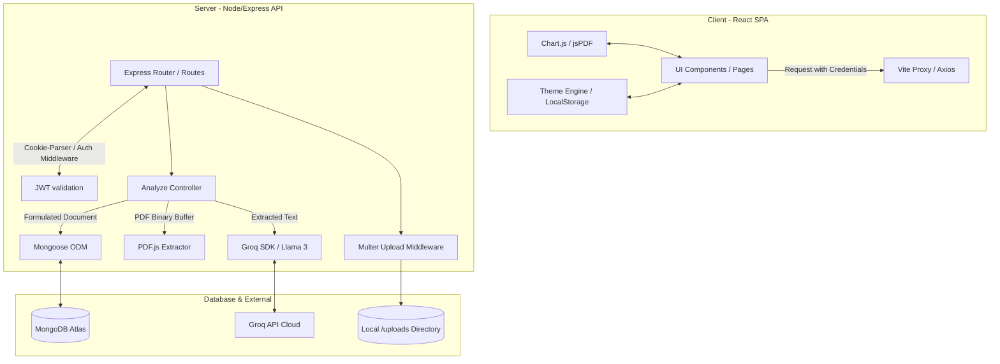

# .Resumlyzer

---

<p align="center">
  
</p>

<p align="center">
  <b>Smart AI-powered resume intelligence platform that analyzes resumes against job descriptions, computes ATS scores, identifies skill gaps, and generates tailored improvement strategies.</b>
</p>

<p align="center">
  
  
  
</p>

---

## 🌟 Key Features

*   **📄 AI-Powered Resume Parsing & Text Extraction**  
    Extracts raw text content from uploaded PDF resumes asynchronously on the server using `pdfjs-dist` libraries.
*   **🎯 Precision ATS Scoring**  
    Computes a weighted comprehensive ATS Score out of 100 based on four critical indices:
    *   **Skills Alignment (45%):** Depth of matching technical keywords.
    *   **Content Relevance (25%):** Quantifiable results, metrics, and word-count evaluation.
    *   **Structure & Formatting (15%):** Formatting, section presence, and bullet point structure.
    *   **Tone & Action (15%):** Utilization of strong action verbs and industry-standard phrasing.
*   **📊 Dynamic Score Breakdown**  
    Renders interactive canvas-based radar/bar charts (using Chart.js) and animated score rings that dynamically change color (Red / Yellow / Green) depending on score thresholds.
*   **🔍 Skill Comparison Engine**  
    Separates technical skills into **Matched Core Skills** and **Missing Required Skills** to show candidates exactly where their resumes fall short.
*   **💡 Contextual, Highlighted Feedback**  
    Generates actionable, tailored bulleted suggestions for resume improvements. Crucial keywords (e.g. specific frameworks, metrics, verbs) are dynamically highlighted in a glowing yellow theme.
*   **🗂️ Analysis History Dashboard**  
    A history panel allowing registered users to revisit past analyses, view scores, inspect JDs, and track their improvement progress over time.
*   **📥 Exportable PDF Reports**  
    Generate and download detailed resume analysis reports directly from the client side using `jsPDF`.
*   **🌓 Unified Dark/Light Mode Theme**  
    A persistent visual theme utilizing localStorage, styled with modern glassmorphism, glowing gradients, and smooth state transitions.

---

## 🔄 App Flow (Sequence of Operations)

1.  **User Authentication:** User registers or logs in. Upon successful verification, the backend issues a signed JSON Web Token (JWT) set inside an `httpOnly`, `SameSite=Lax/None` cookie.
2.  **Upload & JD Input:** The user accesses the dashboard, uploads a PDF resume, and enters the target job title/description.
3.  **File Upload Handling:** The client submits a `multipart/form-data` request to `/api/analyze`. The backend uses `Multer` to intercept the file and write it to local storage (`/uploads`).
4.  **Text Extraction:** The backend reads the saved PDF file into a binary buffer, parses the pages sequentially using Mozilla's PDF.js library, and flattens it into text.
5.  **Multiphase AI Analysis (via Groq API):**
    *   **Phase A:** Extract technical skills from the resume text.
    *   **Phase B:** Extract required core skills based on the target role.
    *   **Phase C:** Compare resume skills against target requirements to determine matched vs. missing sets.
    *   **Phase D:** Review the resume context to generate qualitative, actionable improvements.
6.  **Scoring & Formatting:** The server evaluates text metrics (word count, action verbs, percentages, structure headers) to calculate the sub-scores and final ATS score. It also processes suggestions, injecting markup tags around critical key terms.
7.  **Database Recording:** The analysis record is committed to MongoDB under the corresponding authenticated user ID.
8.  **Client Render & Export:** The client receives the JSON payload, triggers count-up animations for the scores, draws the chart dashboards, lists the matching/missing skills, and enables PDF report downloads.

---

## 🏗️ Architecture

Resumlyzer is built using a decoupled Client-Server architecture organized in a monorepo setup:



---

## 🛠️ Tech Stack & Why

### Frontend (Client)
*   **React.js (v19)**  
    *Why:* Offers a component-driven structure ideal for building interactive dashboards. The virtual DOM guarantees fluid rendering for score-ring counters and charts.
*   **Vite**  
    *Why:* Extremely fast bundling times, instant Hot Module Replacement (HMR), and lightweight configurations compared to Webpack.
*   **Tailwind CSS (v4)**  
    *Why:* Utility-first styling engine that drastically reduces CSS size. Its modern theme configurations simplify custom dark/light glassmorphic card designs.
*   **Chart.js & React-Chartjs-2**  
    *Why:* Canvas-rendered, lightweight visualizations perfect for plotting multi-axis performance breakdowns.
*   **jsPDF**  
    *Why:* Handles client-side PDF document compilation, reducing computational load on the Node.js backend.

### Backend (Server)
*   **Node.js & Express.js**  
    *Why:* Single-threaded event-driven loop handles high concurrency for network requests and uploads. Express simplifies routing and middleware inclusion.
*   **MongoDB & Mongoose**  
    *Why:* Document-oriented storage is the perfect fit for JSON-formatted analysis histories containing variable arrays (suggestions, keywords, sub-scores).
*   **Multer**  
    *Why:* The standard node middleware for efficiently capturing multipart forms containing file streams.
*   **pdfjs-dist**  
    *Why:* Enables server-side text extraction from PDF files directly in Node.js without requiring external CLI tools.

### AI Inference
*   **Groq SDK**  
    *Why:* Utilizes Groq’s LPU (Language Processing Unit) architecture. It processes Llama 3 models at incredibly high tokens-per-second, reducing user wait times from 10–15 seconds to under 2 seconds.

---

## 🔑 Environment Variables

To run the application, configure the environment variables in both the client and server directories:

### Client configuration (`/ai-ats-resume-analyzer/client/.env`)
```env
VITE_API_URL=http://localhost:5000
```
*   `VITE_API_URL`: Points to your hosted backend API url (or `http://localhost:5000` during local development).

### Server configuration (`/ai-ats-resume-analyzer/server/.env`)
```env
PORT=5000
MONGO_URI=your_mongodb_connection_string
GROQ_API_KEY=your_groq_cloud_api_key
JWT_SECRET=your_jwt_signature_secret
```
*   `PORT`: Port number on which the Express API server runs (default: `5000`).
*   `MONGO_URI`: MongoDB connection string (Atlas or Local instance).
*   `GROQ_API_KEY`: API access token obtained from Groq console.
*   `JWT_SECRET`: A cryptographic key used to sign and verify user cookies.

---

## 🔐 Authentication Flow

1.  **Session Security:** User credentials (email/password) are submitted to `/api/auth/login`. The server verifies them and generates a JSON Web Token (JWT) containing the user ID.
2.  **Cookie Attachment:** The JWT token is returned in the response header inside a secure cookie:
    ```javascript
    res.cookie("token", token, {
      httpOnly: true,                 // Block javascript access (XSS defense)
      sameSite: isProd ? "none" : "lax", // Prevent CSRF attacks
      secure: isProd,                 // Enforce HTTPS transmission in production
    });
    ```
3.  **Route Protection:** The frontend client utilizes a `<ProtectedRoute>` wrapper checking for session cookies.
4.  **Backend Verification Middleware:** All private endpoints (like `/api/analyze` or `/api/history`) pass through `protect` middleware, which parses the cookie, verifies the token, and attaches the user model instance to `req.user`.
5.  **Session Termination:** Logging out calls the `/api/auth/logout` endpoint, which commands the client browser to immediately clear the `token` cookie.

---

## 🗂️ Project Folder Structure

```text
ATS_RESUME_ANALYSER/
│
├── 5410980.png                      # App Header Image (Banner)
│
└── ai-ats-resume-analyzer/          # Core Application Root
    ├── client/                      # Frontend Application (Vite + React)
    │   ├── public/                  # Static assets
    │   ├── src/
    │   │   ├── assets/              # Icons, local images, and custom fonts
    │   │   ├── components/          # Reusable UI components
    │   │   │   ├── ProtectedRoute.jsx
    │   │   │   ├── analysis/        # Resume review visual dashboards
    │   │   │   │   ├── ATSChecklist.jsx
    │   │   │   │   ├── ATSScoreCard.jsx
    │   │   │   │   ├── CircularScore.jsx
    │   │   │   │   ├── HighlightedJD.jsx
    │   │   │   │   ├── KeywordMatchPanel.jsx
    │   │   │   │   ├── ScoreBreakdown.jsx
    │   │   │   │   └── SuggestionsPanel.jsx
    │   │   │   └── upload/
    │   │   │       └── ResumeUploadCard.jsx
    │   │   ├── pages/               # Routing Views
    │   │   │   ├── History.jsx      # Past results dashboard
    │   │   │   ├── Landing.jsx      # Landing introduction screen
    │   │   │   ├── Login.jsx        # Login gateway
    │   │   │   ├── Register.jsx     # Registration form
    │   │   │   └── Review.jsx       # Resume upload / main analysis workspace
    │   │   ├── utils/               # Client helper scripts (keyword processing)
    │   │   │   └── keywordUtils.js
    │   │   ├── App.css
    │   │   ├── App.jsx              # Client router definitions
    │   │   ├── index.css            # Tailwind directive styles & theme configurations
    │   │   └── main.jsx             # React DOM injection point
    │   ├── package.json             # Frontend dependencies
    │   ├── tailwind.config.js
    │   └── vite.config.js
    │
    └── server/                      # Backend API Server (Node + Express)
        ├── controllers/             # Business Logic Layer
        │   ├── analyzeController.js # PDF extract, AI Prompt, Score formula
        │   └── authController.js    # Register, login, cookies management
        ├── middleware/              # Interceptors
        │   └── authMiddleware.js    # Cookie token validation
        ├── models/                  # Database Schemas
        │   ├── ResumeAnalysis.js    # Schema for storing scored analysis history
        │   └── User.js              # Schema for user authorization profiles
        ├── routes/                  # API Endpoints mapping
        │   ├── analyzeRoutes.js
        │   ├── authRoutes.js
        │   ├── historyRoutes.js
        │   └── meRoute.js
        ├── uploads/                 # Local directory hosting uploaded PDFs
        ├── utils/                   # Shared scripts (Groq Client wrapper)
        │   └── groqClient.js
        ├── index.js                 # App Entry, DB connection, CORS, port listener
        └── package.json             # Backend dependencies
```

---

## 🚀 Getting Started

### 📋 Prerequisites
*   Node.js (v18+)
*   MongoDB Instance (local or Atlas cluster)
*   Groq API Key

### 🛠️ Installation & Running

1.  **Clone the Repository** and navigate to the project root:
    ```bash
    cd ATS_RESUME_ANALYSER/ai-ats-resume-analyzer
    ```
2.  **Start Backend Server:**
    ```bash
    cd server
    npm install
    # Create a .env file containing the required MONGO_URI and GROQ_API_KEY
    npm run dev
    ```
3.  **Start Frontend Client:**
    ```bash
    cd ../client
    npm install
    # Create a .env file with VITE_API_URL=http://localhost:5000
    npm run dev
    ```
4.  Open `http://localhost:5173` in your browser.
